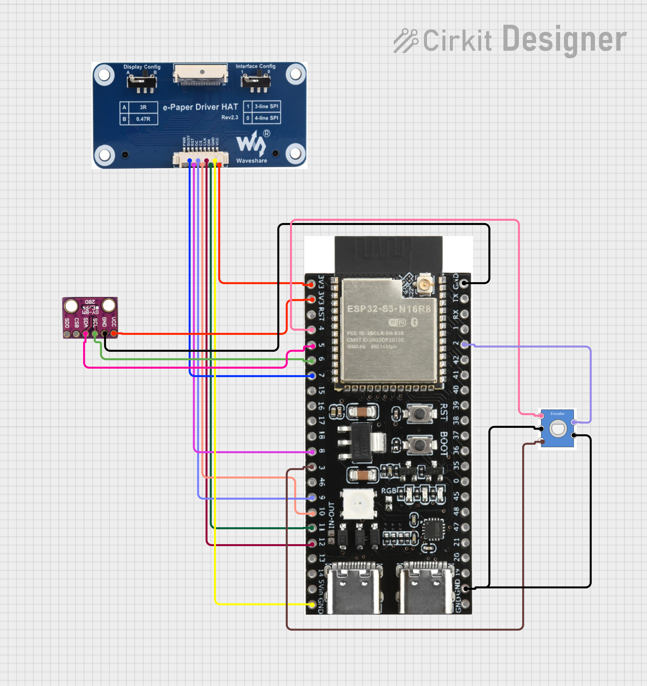

# InkDesk Companion

InkDesk is a calm, always-on desk companion using a 7.5" e-paper display.
It shows useful information at a glance while consuming very little power.

The goal is to create a minimal, distraction-free device that displays
important daily information such as time, weather, and environment data.

#### and why i created it?
im neurodivergent and yea this could really help me on my day to day tbh um

## stuff it haves/does

- To-do list display
- Weather information
- Time display
- Room temperature and humidity
- Time awareness visualization
- Rotary encoder navigation

## hardware

- ESP32-S3-N16R8
- 7.5" e-ink display (SPI)
- BME280 environmental sensor
- EC11 rotary encoder

## wiring

## render 

## bill of materials

| Name | Purpose | Quantity | Total Cost (USD) | Link | Distributor |
|------|---------|----------|------------------|------|-------------|
| EC11 Rotary Encoder | change screens and more | 1 | 0.00 |  | local shop |
| BME280 | temperature, humidity and pressure sensor | 1 | 7.08 | https://www.aliexpress.com/item/1005004527984343.html | Aliexpress |
| E-Paper Driver Board Hat | without this the esp32 wouldnt be able to speak with the e-ink displsy | 1 | 12.93 | https://www.aliexpress.com/item/1005007466742330.html | Aliexpress |
| 7.5" E-ink Display | the display | 1 | 32.80 | https://www.aliexpress.com/item/1005005121813674.html | Aliexpress |
| ESP32-S3-N16R8 | controls the whole project | 1 | 8.79 | https://www.aliexpress.com/item/1005008796158734.html | Aliexpress |
